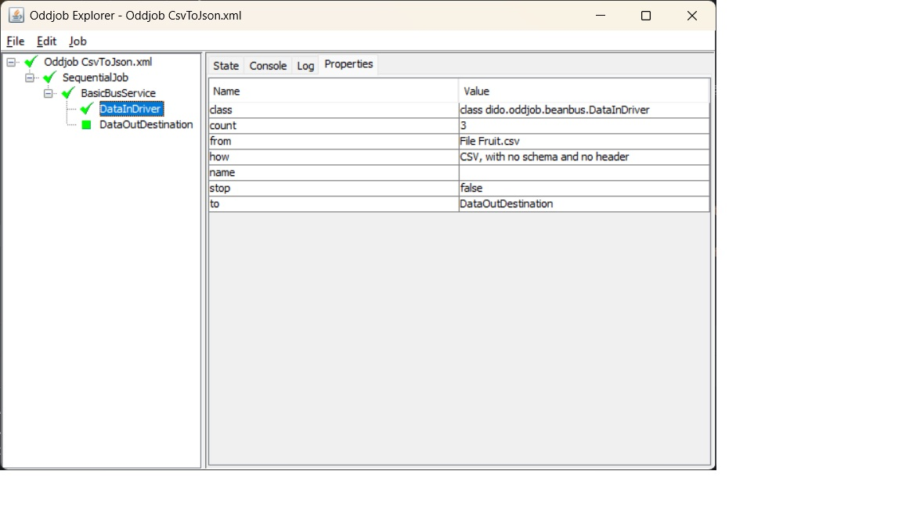

Dido Oddball
============

Dido was initially created to provide Oddjob with the capability to copy and compare data 
from different sources. It was not until later that it was refactored to provide a fluent
API for doing the same in code that you see in the [README](README.md).

The most likely entry point into Oddjob's world is the poorly documented [BeanBus](https://github.com/robjg/oddjob/blob/master/docs/reference/org/oddjob/beanbus/bus/BasicBusService.md)
component. This creates a pipeline that uses a *Bus Driver* to push data to a *Destination*

Dido's Bus Driver is [dido:data-in](docs/reference/dido/oddjob/beanbus/DataInDriver.md) 
and its Destination is [dido:data-out](docs/reference/dido/oddjob/beanbus/DataOutDestination.md)

Here's the simple CSV to JSON from the README just having run in Oddjob.



This is the configuration it used:
```xml
<?xml version="1.0" encoding="UTF-8" standalone="no"?>
<oddjob>
    <job>
        <sequential>
            <jobs>
                <bus:bus xmlns:bus="oddjob:beanbus">
                    <of>
                        <dido:data-in xmlns:dido="oddjob:dido">
                            <how>
                                <dido:csv/>
                            </how>
                            <from>
                                <file file="Fruit.csv"/>
                            </from>
                        </dido:data-in>
                        <dido:data-out xmlns:dido="oddjob:dido">
                            <how>
                                <dido:json/>
                            </how>
                            <to>
                                <stdout/>
                            </to>
                        </dido:data-out>
                    </of>
                </bus:bus>
            </jobs>
        </sequential>
    </job>
</oddjob>
```

And this is how to run it directly from code via Oddjob:
```java
        File config = new File(Objects.requireNonNull(getClass().getClassLoader()
                .getResource("examples/CsvToJson.xml")).getFile());

        Oddjob oddjob = new Oddjob();
        oddjob.setFile(config);

        oddjob.run();
```

Here's the second example from the README configured for Oddjob. This is where we 
specify a schema.  
```xml
<?xml version="1.0" encoding="UTF-8" standalone="no"?>
<oddjob>
    <job>
        <sequential>
            <jobs>
                <variables id="ourVars">
                    <ourSchema>
                        <dido:schema xmlns:dido="oddjob:dido">
                            <of>
                                <dido:field name="Fruit" type="java.lang.String"/>
                                <dido:field name="Qty" type="int"/>
                                <dido:field name="Price" type="double"/>
                            </of>
                        </dido:schema>
                    </ourSchema>
                </variables>
                <bus:bus xmlns:bus="oddjob:beanbus">
                    <of>
                        <dido:data-in xmlns:dido="oddjob:dido">
                            <how>
                                <dido:csv>
                                    <schema>
                                        <value value="${ourVars.ourSchema}"/>
                                    </schema>
                                </dido:csv>
                            </how>
                            <from>
                                <file file="Fruit.csv"/>
                            </from>
                        </dido:data-in>
                        <dido:data-out xmlns:dido="oddjob:dido">
                            <how>
                                <dido:json/>
                            </how>
                            <to>
                                <stdout/>
                            </to>
                        </dido:data-out>
                    </of>
                </bus:bus>
            </jobs>
        </sequential>
    </job>
</oddjob>
```


For more on how to configure the Dido components in Oddjob the best place to start
is the [Reference](docs/reference/README.md)
