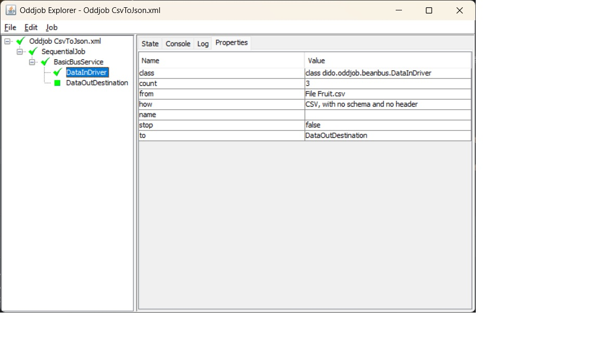

Dido Oddball
============

- [Overview](#overview)
- [An Example](#an-example)
- [Running](#running)
- [A Second Example](#a-second-example)
- [Further Information](#further-information)

### Overview

Dido was initially created to provide Oddjob with the capability to copy and compare data 
from different sources. It was not until later that it was refactored to provide a fluent
API for doing the same in code that you see in the [README](../README.md).

The most likely entry point into Oddjob's world is the poorly documented [BeanBus](https://github.com/robjg/oddjob/blob/master/docs/reference/org/oddjob/beanbus/bus/BasicBusService.md)
component. This creates a pipeline that uses a *Bus Driver* to push data to a *Destination*

Dido's Bus Driver is [dido:data-in](reference/dido/oddjob/beanbus/DataInDriver.md) 
and its Destination is [dido:data-out](reference/dido/oddjob/beanbus/DataOutDestination.md)

### An Example

Here's the simple CSV to JSON from the README just having run in Oddjob.



This is the configuration it used:
```xml
<?xml version="1.0" encoding="UTF-8" standalone="no"?>
<oddjob>
    <job>
        <sequential>
            <jobs>
                <bus:bus xmlns:bus="oddjob:beanbus">
                    <of>
                        <dido:data-in xmlns:dido="oddjob:dido">
                            <how>
                                <dido:csv/>
                            </how>
                            <from>
                                <file file="Fruit.csv"/>
                            </from>
                        </dido:data-in>
                        <dido:data-out xmlns:dido="oddjob:dido">
                            <how>
                                <dido:json/>
                            </how>
                            <to>
                                <stdout/>
                            </to>
                        </dido:data-out>
                    </of>
                </bus:bus>
            </jobs>
        </sequential>
    </job>
</oddjob>
```


### Running

And this is how to run it directly from code via Oddjob:
```java
        File config = new File(Objects.requireNonNull(getClass().getClassLoader()
                .getResource("examples/CsvToJson.xml")).getFile());

        Oddjob oddjob = new Oddjob();
        oddjob.setFile(config);

        oddjob.run();
```

The dependencies for this example were resolved using Maven.
Look at [dido-examples/pom.xml](../dido-examples/pom.xml) for what was required.
If you use the Downloaded Oddjob Application then Dido can be resolved 
as an 'Oddball'. Here is the configuration to enable the example to be run in this
way:
```xml
<?xml version="1.0" encoding="UTF-8" standalone="no"?>
<oddjob id="oddjob">
    <job>
        <sequential>
            <jobs>
                <resolve:resolve id="resolveDido" xmlns:resolve="oddjob:resolve">
                    <dependencies>
                        <resolve:dependency artifactId="dido-all" groupId="uk.co.rgordon" type="pom" version="2.0.0-SNAPSHOT"/>
                    </dependencies>
                </resolve:resolve>
                <copy name="Copy Sample File" to="Fruit.csv">
                    <from>
                        <file file="${oddjob.dir}/../data/FruitNoHeader.csv"/>
                    </from>
                </copy>
                <oddjob file="${oddjob.dir}/CsvToJson.xml">
                    <descriptorFactory>
                        <oddballs>
                            <oddballs>
                                <oddball>
                                    <paths>
                                        <value value="${resolveDido.resolvedPathsArray}"/>
                                    </paths>
                                </oddball>
                            </oddballs>
                        </oddballs>
                    </descriptorFactory>
                </oddjob>
                <delete>
                    <files>
                        <file file="Fruit.csv"/>
                    </files>
                </delete>
            </jobs>
        </sequential>
    </job>
</oddjob>
```

Obviously this complicates the configuration somewhat. It would be
quite simple to create an Oddjob that copied the resolved files into Oddjob's Oddball 
directory so that Dido was permanently available within Oddjob. 

### A Second Example

Here's the second example from the README configured for Oddjob. This is where we 
specify a schema.  
```xml
<?xml version="1.0" encoding="UTF-8" standalone="no"?>
<oddjob>
    <job>
        <sequential>
            <jobs>
                <variables id="ourVars">
                    <ourSchema>
                        <dido:schema xmlns:dido="oddjob:dido">
                            <of>
                                <dido:field name="Fruit" type="java.lang.String"/>
                                <dido:field name="Qty" type="int"/>
                                <dido:field name="Price" type="double"/>
                            </of>
                        </dido:schema>
                    </ourSchema>
                </variables>
                <bus:bus xmlns:bus="oddjob:beanbus">
                    <of>
                        <dido:data-in xmlns:dido="oddjob:dido">
                            <how>
                                <dido:csv>
                                    <schema>
                                        <value value="${ourVars.ourSchema}"/>
                                    </schema>
                                </dido:csv>
                            </how>
                            <from>
                                <file file="Fruit.csv"/>
                            </from>
                        </dido:data-in>
                        <dido:data-out xmlns:dido="oddjob:dido">
                            <how>
                                <dido:json/>
                            </how>
                            <to>
                                <stdout/>
                            </to>
                        </dido:data-out>
                    </of>
                </bus:bus>
            </jobs>
        </sequential>
    </job>
</oddjob>
```


### Further Information

For more on how to configure the Dido components in Oddjob the best place to start
is the [Reference](reference/README.md)
