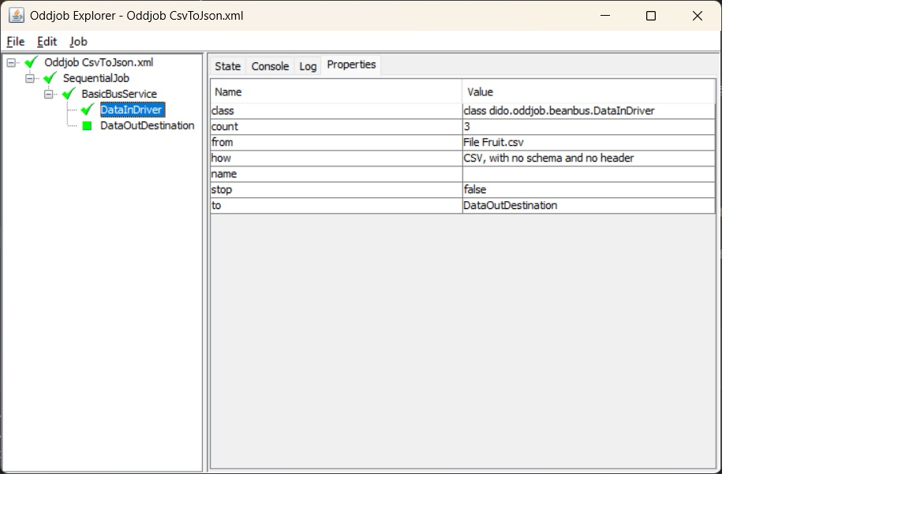

Dido in Oddjob
==============

- [Overview](#overview)
- [An Example](#an-example)
- [Running](#running)
- [A Second Example](#a-second-example)
- [Further Information](#further-information)

### Overview

Dido was initially created to provide Oddjob with the capability to copy and compare data 
from different sources. It was not until later that it was refactored to provide a fluent
API for doing the same in code that you see in the [README](../README.md).

The most likely entry point into Oddjob's world is the poorly documented [BeanBus](https://github.com/robjg/oddjob/blob/master/docs/reference/org/oddjob/beanbus/bus/BasicBusService.md)
component. This creates a pipeline that uses a *Bus Driver* to push data to a *Destination*

Dido's Bus Driver is [dido:data-in](reference/dido/oddjob/beanbus/DataInDriver.md) 
and its Destination is [dido:data-out](reference/dido/oddjob/beanbus/DataOutDestination.md)

### An Example

Here's the simple CSV to JSON from the README just having run in Oddjob.



This is the configuration it used:
```xml
<?xml version="1.0" encoding="UTF-8" standalone="no"?>
<oddjob id="oddjob">
    <job>
        <sequential>
            <jobs>
                <bus:bus xmlns:bus="oddjob:beanbus">
                    <of>
                        <dido:data-in xmlns:dido="oddjob:dido">
                            <how>
                                <dido:csv-in/>
                            </how>
                            <from>
                                <file file="${oddjob.dir}/../data/FruitNoHeader.csv"/>
                            </from>
                        </dido:data-in>
                        <dido:data-out xmlns:dido="oddjob:dido">
                            <how>
                                <dido:json-out/>
                            </how>
                            <to>
                                <stdout/>
                            </to>
                        </dido:data-out>
                    </of>
                </bus:bus>
            </jobs>
        </sequential>
    </job>
</oddjob>
```


### Running

And this is how to run it directly from code via Oddjob:
```java
        File config = new File(Objects.requireNonNull(getClass().getClassLoader()
                .getResource("examples/CsvToJson.xml")).getFile());

        Oddjob oddjob = new Oddjob();
        oddjob.setFile(config);

        oddjob.run();
```

The dependencies for this example were resolved using Maven.
Look at [dido-examples/pom.xml](../dido-examples/pom.xml) for what was required.

To help getting started, if you have Maven installed, clone this repo, and from a command prompt 
change directory to `dido-examples` and run:
```shell
mvn exec:exec@example1 -P examples 
```
You will see
```
{"f_1":"Apple","f_2":"5","f_3":"19.50"}
{"f_1":"Orange","f_2":"2","f_3":"35.24"}
{"f_1":"Pear","f_2":"3","f_3":"26.84"}
```


To launch Oddjob Explorer with this example loaded run:
```shell
mvn exec:exec@oddjob-explorer-example1 -P examples 
```

For more advanced options for running in Oddjob see [dido-oddball](DIDO-ODDBALL.md)

### A Second Example

Here's the second example from the README configured for Oddjob. This is where we 
specify a schema.  
```xml
<?xml version="1.0" encoding="UTF-8" standalone="no"?>
<oddjob>
    <job>
        <sequential>
            <jobs>
                <variables id="ourVars">
                    <ourSchema>
                        <dido:schema xmlns:dido="oddjob:dido">
                            <of>
                                <dido:field name="Fruit" type="java.lang.String"/>
                                <dido:field name="Qty" type="int"/>
                                <dido:field name="Price" type="double"/>
                            </of>
                        </dido:schema>
                    </ourSchema>
                </variables>
                <bus:bus xmlns:bus="oddjob:beanbus">
                    <of>
                        <dido:data-in xmlns:dido="oddjob:dido">
                            <how>
                                <dido:csv-in>
                                    <schema>
                                        <value value="${ourVars.ourSchema}"/>
                                    </schema>
                                </dido:csv-in>
                            </how>
                            <from>
                                <file file="Fruit.csv"/>
                            </from>
                        </dido:data-in>
                        <dido:data-out xmlns:dido="oddjob:dido">
                            <how>
                                <dido:json-out/>
                            </how>
                            <to>
                                <stdout/>
                            </to>
                        </dido:data-out>
                    </of>
                </bus:bus>
            </jobs>
        </sequential>
    </job>
</oddjob>
```


### Transformations

Dido provides a number of configurable types to allow simple transformations
to be applied to the data. Here we take some JSON lines:
```xml
{"Colour": "Red", "Fruit": "Apple", "Qty":5, "Price":19.5}
{"Qty": 2, "Fruit":"Orange", "Colour": "Orange", "Price":35.24}
{"Qty":3, "Price":26.84, "Colour": "Orange", "Fruit":"Pear"}
```

The element order is random demonstrating that when a Schema is provided, Dido 
does not care about the order of the elements.

This configuration will read the JSON, remove the Colour field, Multiply the Price
to create a new MarkupPrice field and as a constant BestBeforeDate. The date
demonstrates using a ConversionProvider defined with JavaScript to perform the
conversion to and from the `LocalDate` Java type.
```xml
<?xml version="1.0" encoding="UTF-8" standalone="no"?>
<oddjob id="oddjob">
    <job>
        <sequential>
            <jobs>
                <variables id="ourVars">
                    <ourSchema>
                        <dido:schema xmlns:dido="oddjob:dido">
                            <of>
                                <dido:field name="Fruit" type="java.lang.String"/>
                                <dido:field name="Colour" type="java.lang.String"/>
                                <dido:field name="Qty" type="int"/>
                                <dido:field name="Price" type="double"/>
                            </of>
                        </dido:schema>
                    </ourSchema>
                </variables>
                <script id="js" name="Define Conversion Provider"><![CDATA[
function toDate(s) { 
	return Java.type("java.time.LocalDate")
		.parse(s) 
}

function fromDate(d) { 
	return d.format(Java.type("java.time.format.DateTimeFormatter")
		.ofPattern("yyyyMMdd")) 
}

var conversionProvider = 
	Java.type("dido.how.conversion.DefaultConversionProvider").with()
                .conversion(java.lang.String.class, Java.type("java.time.LocalDate").class, toDate)
                .conversion(Java.type("java.time.LocalDate").class, java.lang.String.class, fromDate)
                .make();]]></script>
                <bus:bus xmlns:bus="oddjob:beanbus">
                    <of>
                        <dido:data-in xmlns:dido="oddjob:dido">
                            <how>
                                <dido:json-in format="LINES">
                                    <schema>
                                        <value value="${ourVars.ourSchema}"/>
                                    </schema>
                                    <conversionProvider>
                                        <value value="${js.variable(conversionProvider)}"/>
                                    </conversionProvider>
                                    <didoConversion>
                                        <value key="java.lang.String" value="java.time.LocalDate"/>
                                    </didoConversion>
                                </dido:json-in>
                            </how>
                            <from>
                                <file file="${oddjob.dir}/../data/FruitElementsRandom.jsonl"/>
                            </from>
                        </dido:data-in>
                        <bus:map>
                            <function>
                                <dido:transform withExisting="true" xmlns:dido="oddjob:dido">
                                    <of>
                                        <dido:remove field="Colour"/>
                                        <dido:copy field="Price" to="MarkupPrice">
                                            <type>
                                                <class name="double"/>
                                            </type>
                                            <function>
                                                <value value="#{function(x) { return x * 1.5 } }"/>
                                            </function>
                                        </dido:copy>
                                        <dido:set field="BestBefore">
                                            <value>
                                                <value value="2025-12-15"/>
                                            </value>
                                            <type>
                                                <class name="java.time.LocalDate"/>
                                            </type>
                                            <conversionProvider>
                                                <value value="${js.variable(conversionProvider)}"/>
                                            </conversionProvider>
                                        </dido:set>
                                    </of>
                                </dido:transform>
                            </function>
                        </bus:map>
                        <dido:data-out xmlns:dido="oddjob:dido">
                            <how>
                                <dido:json-out>
                                    <conversionProvider>
                                        <value value="${js.variable(conversionProvider)}"/>
                                    </conversionProvider>
                                    <didoConversion>
                                        <value key="java.time.LocalDate" value="java.lang.String"/>
                                    </didoConversion>
                                </dido:json-out>
                            </how>
                            <to>
                                <stdout/>
                            </to>
                        </dido:data-out>
                    </of>
                </bus:bus>
            </jobs>
        </sequential>
    </job>
</oddjob>
```

The following JSON lines are created:
```xml
{"Fruit":"Apple","Qty":5,"Price":19.5,"MarkupPrice":29.25,"BestBefore":"20251215"}
{"Fruit":"Orange","Qty":2,"Price":35.24,"MarkupPrice":52.86,"BestBefore":"20251215"}
{"Fruit":"Pear","Qty":3,"Price":26.84,"MarkupPrice":40.26,"BestBefore":"20251215"}
```


### Further Information

For more on how to configure the Dido components in Oddjob the best place to start
is the [Reference](reference/README.md)
